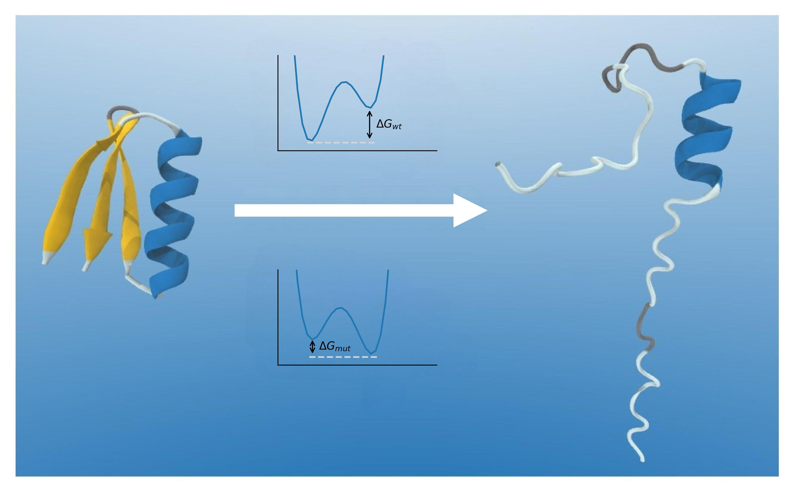

# Protein Phenotype Prediction

This repository holds the code for processing, analysis and model development on the **Mega-scale protein folding stability dataset** (https://www.biorxiv.org/content/10.1101/2022.12.06.519132v1.full.pdf) or to be used on data from https://mavedb.org/#/



## Data

Datasets can be downloaded from https://zenodo.org/record/7401275. Download the *K50_dG_tables.zip* and *Processed_K50_dG_datasets*

The outline of the project is devided into the sections shown and discussed in the following notebooks:

**1)  Data_Analysis_and_Methods_overview.ipynb**

Exploration of dataset features and discussion of prior related models, used in protein modelling and sequence analysis.

**2)  Experiments_and_Model_training.ipynb**

Outline of the chosen experimental strategy & model training

**3) Model_evaluation_and_outlook.ipynb**

Analysis of the predictions made by different model stages and the modelling assumptions, evaluation of ... for improvements and further development

## Computational Environment:

required pacages can be installed with  

```console
conda env create -f prot_ml.yml
```

activate your virtual environment with 
```console
conda activate prot_ml
```
before opening the notebooks. If you are working on COLAB, install the following at the start of the runtime *(>> comment: presumably there is a more  way to add packages from a requirements file to colab, but I am unfamiliar with COLAB and did not have time to spend on this)* 

```python
pip install pytorch-lightning
pip install hydra-core
pip install pyrootutils
pip install mlflow
!pip install torch transformers sentencepiece h5py
``` 


## Precalculated Datasets: 
Notebooks can be run using the provided ***mega_scale_ddg_single_mut_with_seq_no_con.csv*** input file. However, parts of the project use embeddings from the pretrained Large Protein Language Model ProtT5 (https://github.com/agemagician/ProtTrans) which are computationally expensive to extract. Therefore, the calculated per_residue and per_protein embeddings for all sequences (....h5) and for a subset used here for training (.... h5) will also be provided separately. These files should be placed in the *'protT5/output* directory.

The model development is done with the models defined in the protml module (protml folder). 


# The protml training module

The protml module defines models and model components to train on protein sequences and map them to phenotype. The protml model uses [Hydra](https://hydra.cc/) for experiment configuration management to allow for quick and convenient experiment configuration and hyperparameter optimization. Hydra allows configuration of basic model parameters in hierachically structured .yaml files, that can be combined as well as overrideen from the commandline to easily modify individual hyperparameters.  

[Documentation of all module components](https://andreagraf.github.io/Protein_ML/)

For example, the configurations for the ML models would contain YAML descriptions for all individual components. For example, a simmple MLP `encoder` component looks as follows:

```yaml
_target_: protml.models.encoders.VariationalEncoder
model_params:
  hidden_layer_sizes: [100, 100, 50]
  z_dim: ${z_dim}
  nonlinear_activation: "relu"
  dropout_prob: 0.0
  mu_bias_init: 0.1
  log_var_bias_init: -10.0
```

The `_target_` attribute allows Hydra to instantiate the underlying Model_Class associated with the YAML description. In the run, any argument to the encoder class can simply be changed  by e.g.

```console

python3 -m protml.apps.train experiment=supervised/train_base \
    train_data= < PATH_TO_TRAINING_DATA >\
     val_data=D< PATH_TO_VALIDATION_DATA > \
        trainer.max_epochs=50000\
        model.encoder.model_params.hidden_layer_sizes=[100,100,100,100,100] z_dim=10
```

where the *experiment* keyword specifies the basic experiment setup (Experiments are located in  *protml/configs/experiment* ) and the *model.encoder.model_params.hidden_layer_sizes=[100,100,100,100,100]*  specifies the new architecture of the encoder module. 


Several run command examples can be  found in the 2. notebook : *Experiments_and_Model_training.ipynb*
